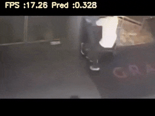
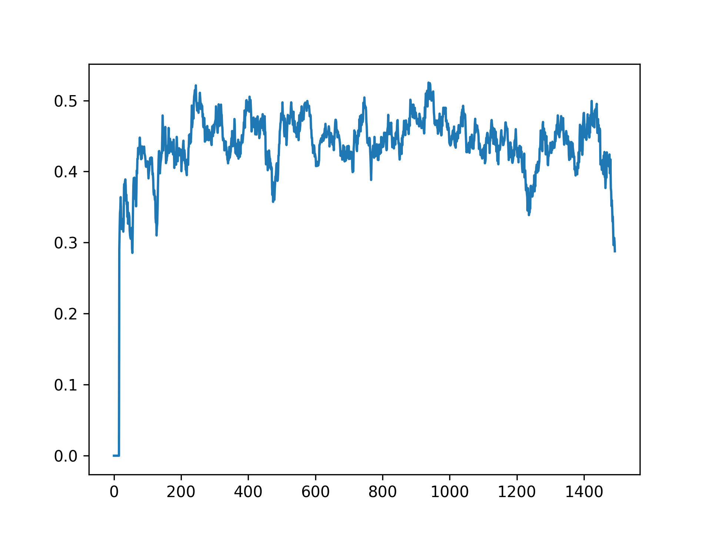

# Video Classification and Anomaly Detection
This is our deep learning project of group 12 

link drive for report and weight of models: https://drive.google.com/drive/folders/1WCGLPBoWY2ovkOcNZLrQ5jC0fDF_u5uJ

Project aim: detect which video has anomalies and where it happens

Dataset: UCF-Crime real-world surveillance videos, you can download or read more about it here: https://www.dropbox.com/sh/75v5ehq4cdg5g5g/AABvnJSwZI7zXb8_myBA0CLHa?dl=0

Full-dataset is used for Anomaly Detection while only a small part of it is used for classification, small part can be referred here: https://www.kaggle.com/datasets/mission-ai/crimeucfdataset  

## Infer

Step 1: Go to the small dataset https://www.kaggle.com/datasets/mission-ai/crimeucfdataset then create notebook or full-dataset one https://www.kaggle.com/datasets/minmints/ufc-crime-full-dataset, set the accelerator to GPU T4 x2

Step 2: Download weight of model

```python
import requests
import os

url = 'https://drive.google.com/uc?id=1-2EQRKO0jUnGPhU_3GuqtyAyu4FS93BR&export=download&confirm=t&uuid=12eaf101-0796-4f5b-813b-cbe20b5dbde0'
save_dir = '/kaggle/working/'
response = requests.get(url)

with open(os.path.join(save_dir, 'model.pth'), 'wb') as f:
    f.write(response.content)
    
url = 'https://drive.google.com/uc?id=1L6Z5df37lb7LDiag17MB3XCrQfwBcGeU&export=download&confirm=t&uuid=12eaf101-0796-4f5b-813b-cbe20b5dbde0'
response = requests.get(url)

with open(os.path.join(save_dir, 'RGB_Kinetics_16f.pth'), 'wb') as f:
    f.write(response.content)

```
Step 3: Infer, '/kaggle/input/crimeucfdataset/Anomaly_Dataset/Anomaly_Videos/Anomaly-Videos-Part-1/Arrest/Arrest002_x264.mp4' is the file_path, you can change to file_path you want to predict

```python
!git clone https://github.com/Min-KiD/DLProject-AnomalyDetected
%cd DLProject-AnomalyDetected/infer
!python /kaggle/working/DLProject-AnomalyDetected/infer/infer.py '/kaggle/input/crimeucfdataset/Anomaly_Dataset/Anomaly_Videos/Anomaly-Videos-Part-1/Arrest/Arrest002_x264.mp4'
```

Alternative method, you can run our `demo.ipynb` for all of these

## Feature Extraction for Anomaly Detection

we use I3D for Spatial-Temporal 32 segments feature extraction with output is rgb and optical flow numpy file

- Input
The inputs are paths to video files. Paths can be passed as a list of paths or as a text file formatted with a single path per line.

- Output
Output is defined by the on_extraction argument; by default it prints the features to the command line. Possible values of output are ['print', 'save_numpy', 'save_pickle']. save options save the features in the output_path folder with the same name as the input video file but with the .npy or .pkl extension.

Read more and run in file `feature-extraction.ipynb`

## Training for Anomaly Detection 

After finishing extract feature for full-dataset, we will use it for training, it already has been uploaded to Kaggle: https://www.kaggle.com/datasets/kanishkarav/ucf-crime-video-dataset

File `model.ipynb` will train then save weight model

## Some Results 

### Classification

### Anomaly Detection 

<td>

## Demo

File `DemoVidA.ipynb`, remember to check the path to weight of the model and its output path if you want to run this

<table>
  <tr>
    <td></td> <td>
  <tr>
</table>
